# 实验报告

## 1. 实验目的

训练代理模型（Surrogate Model），从 22×22 的二值拓扑结构预测 S11 幅度（`|S11|`）。

## 2. 实验配置

| 项目 | 值 |
|------|-----|
| 模型 | EMResnet (CifarResNet, layers=[2,2,2]) |
| 输入 | 22×22 拓扑（1 通道，缩放到 [-1, 1]） |
| 输出 | S11 幅度，60 个频点（0.1 ~ 29.6 GHz） |
| 损失函数 | L1 |
| 优化器 | AdamW (lr=0.001, betas=[0.9,0.95], wd=1e-5) |
| 学习率调度 | CosineAnnealingLR (T_max=200, eta_min=1e-5) |
| 训练轮数 | 200 |
| 训练集 | 14472 条 |
| 测试集 | 1809 条 |
| 配置文件 | `conf/surrogate_s11.conf` |
| 检查点 | `best_checkpoint.pt` |

## 3. 训练过程

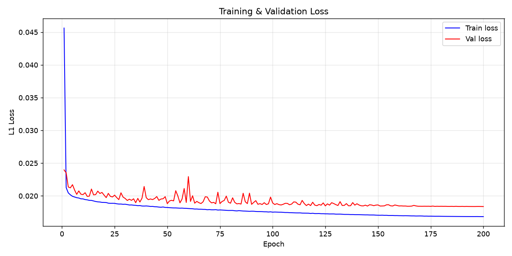

- 最优验证损失：**0.018375**（epoch 200) 。
- 最终验证损失：0.018375
- 最终学习率：0.000010

## 4. 测试集评估

| 指标 | 值 |
|------|-----|
| MAE | 0.017601 |
| RMSE | 0.019753 |
| 中位数 | 0.016047 |
| 最大值 | 0.066031 |

## 5. 样本预测对比

以下为 10 个随机测试样本的预测值（蓝色实线）与仿真值（红色虚线）对比：

### 样本 #243

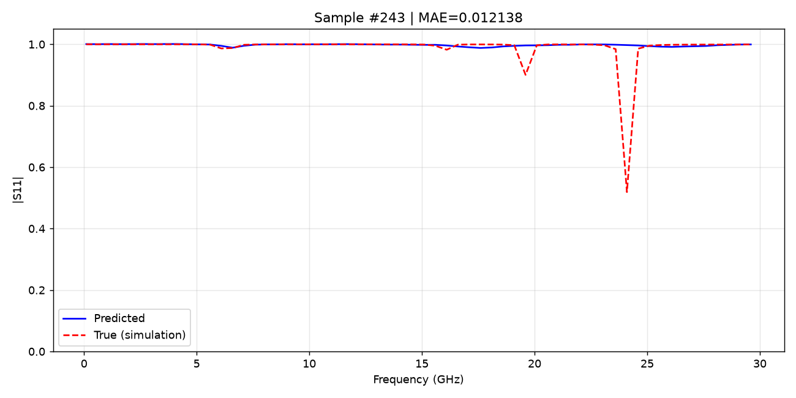

---

### 样本 #331

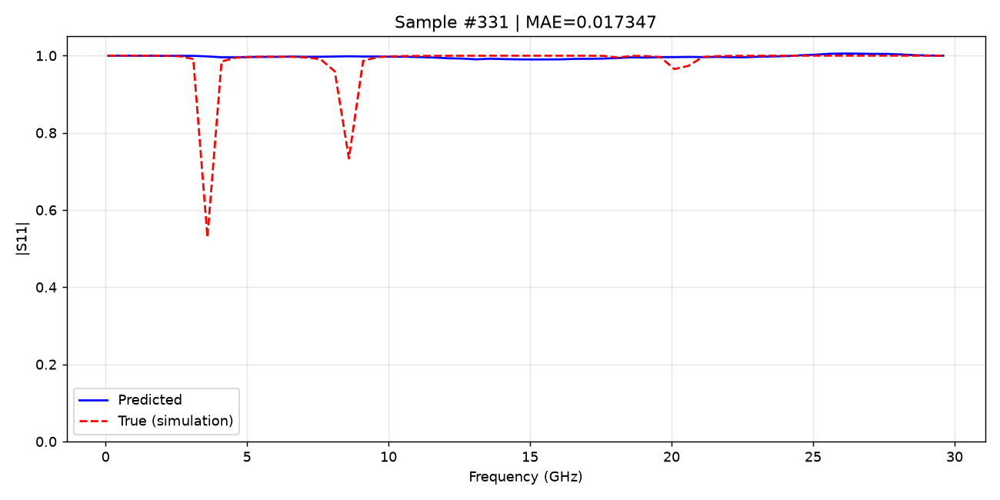

---

### 样本 #506

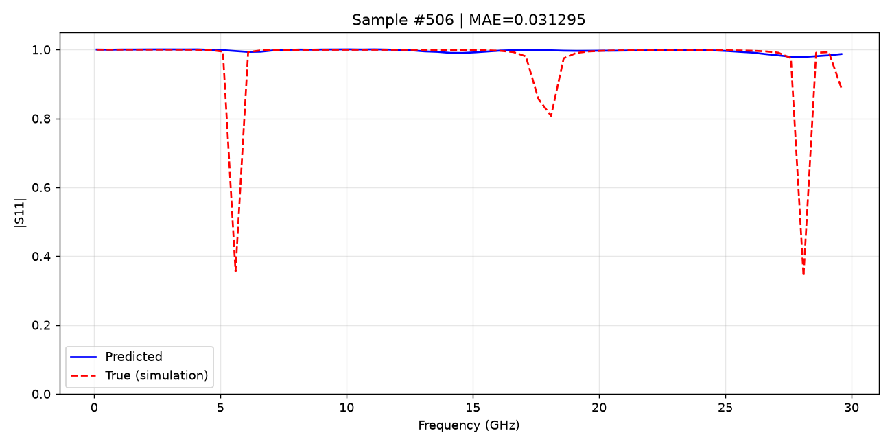

---

### 样本 #679

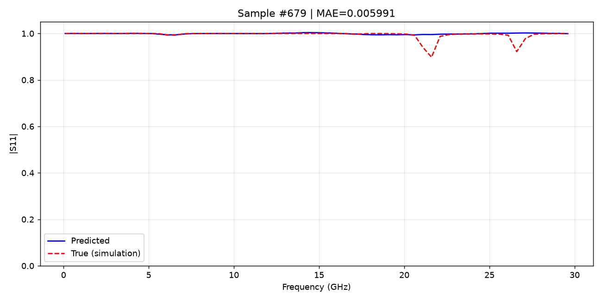

---

### 样本 #682

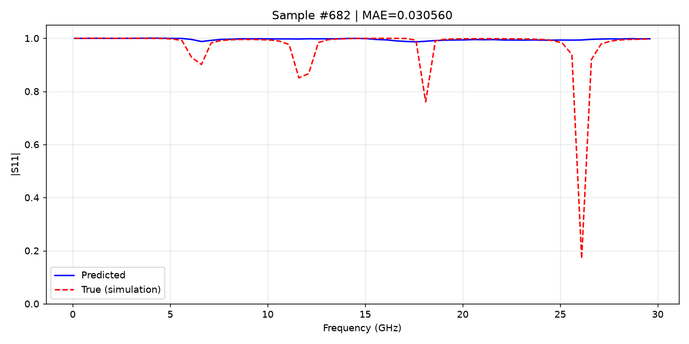

---

### 样本 #813

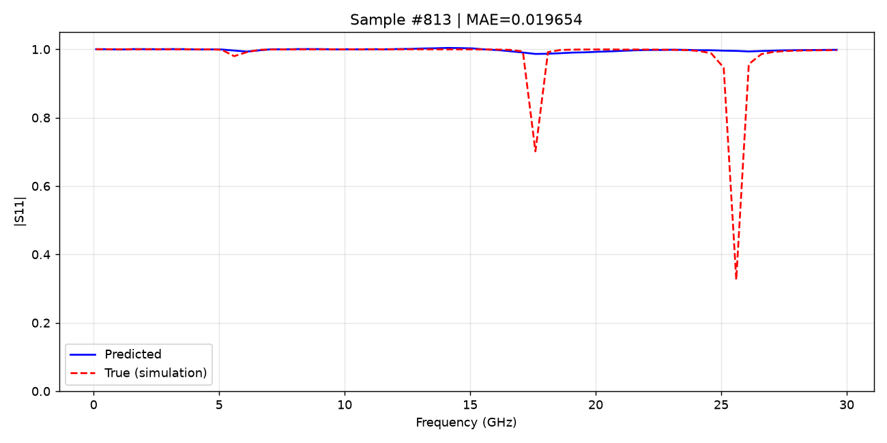

---

### 样本 #1144

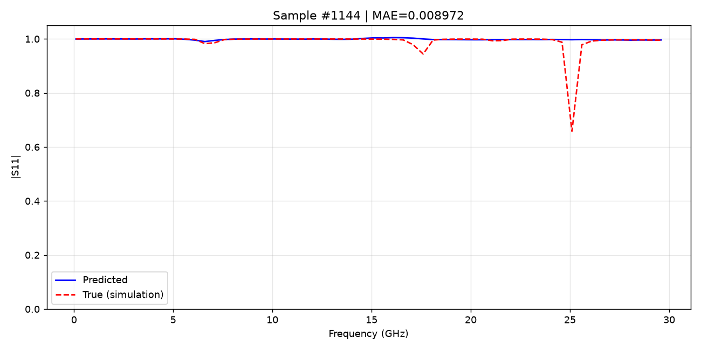

---

### 样本 #1252

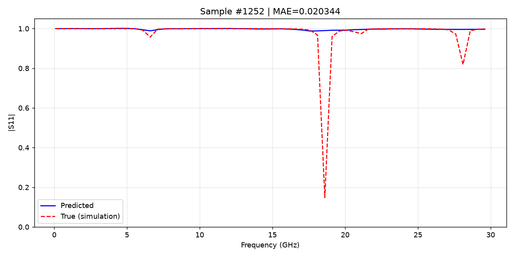

---

### 样本 #1328

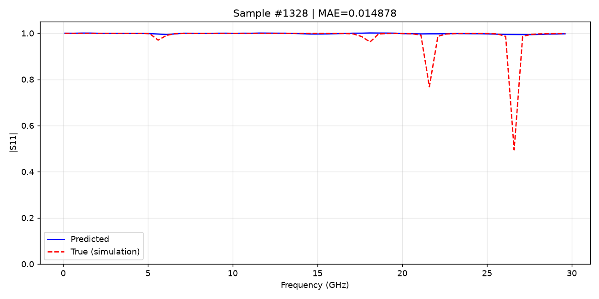

---

### 样本 #1697

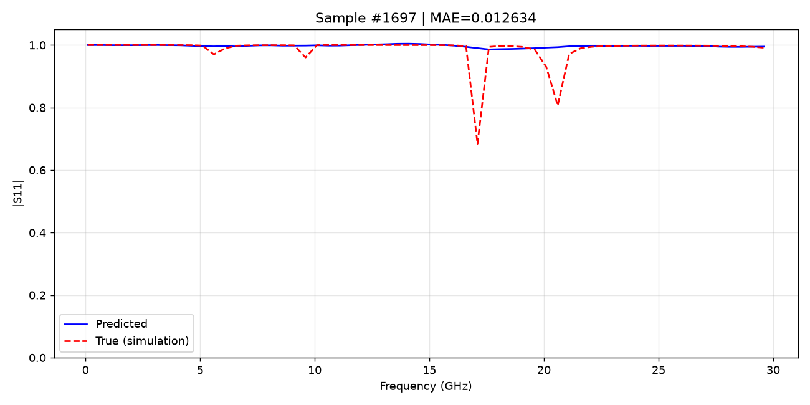

## 6. 结论

代理模型在测试集上达到 **MAE=0.017601**、**RMSE=0.019753**（S11 幅度范围为 [0, 1]）。模型能够较好地近似电磁仿真结果。
